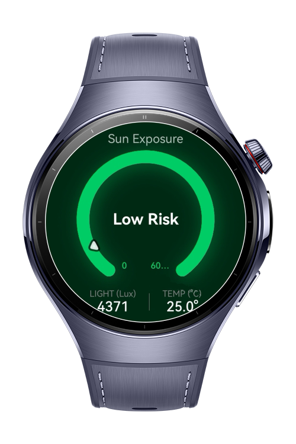
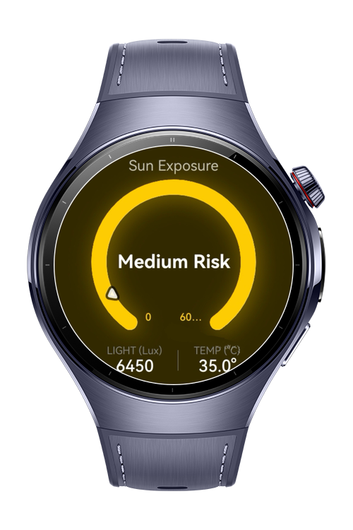
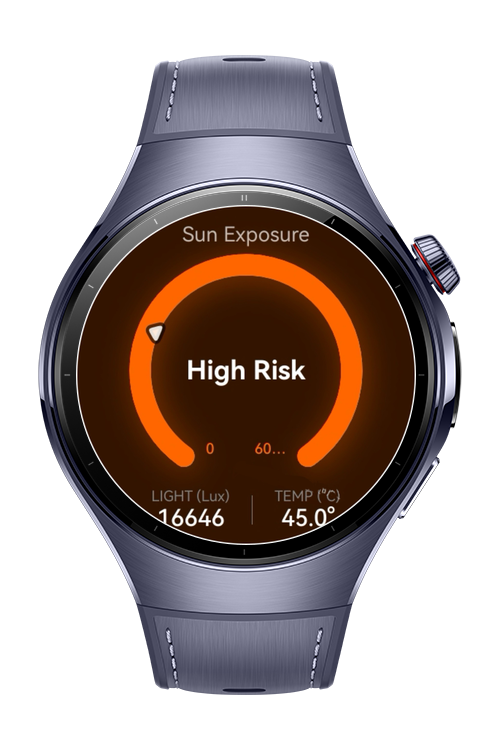
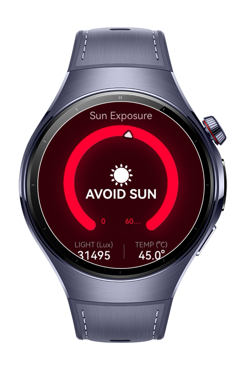

> **Note:** To access all shared projects, get information about environment setup, and view other guides, please visit [Explore-In-HMOS-Wearable Index](https://github.com/Explore-In-HMOS-Wearable/hmos-index).

# SunExposureTracker

This is a specialized health and safety application designed to monitor environmental conditions and provide real-time sun exposure risk assessment for users of HarmonyOS NEXT wearable devices. Built using ArkTS and ArkUI, the application leverages advanced sensor APIs (Ambient Light and Ambient Temperature) to calculate risk and utilizes haptic feedback for critical warnings, all optimized for the circular screen of wearables.
# Preview

<div>




</div>

# Use Cases

This demo application provides:
- Real-time Sensor Monitoring: Continuously tracks and displays Ambient Light Intensity (Lux) and Ambient Temperature (°C) via the device's sensor kit.
- Dynamic Risk Assessment: Calculates the user's current sun exposure risk level (Low, Medium, High) based on a combined algorithm of light and temperature inputs.- Receive haptic feedback at each kilometer milestone during the running session.
- Visual Feedback: Dynamically updates the UI with color-coded indicators corresponding to the calculated risk level.
- Provides immediate and noticeable vibration warnings when the risk level reaches High or Extreme (AVOID SUN), serving as a critical safety alert.
- Features a clean, high-contrast, and glanceable UI optimized for the constraints and aesthetics of wearable screens.
- MVVM Architecture: Uses a ViewModel pattern to ensure clean separation of UI and business logic (sensor handling, risk calculation, vibration control).


# Tech Stack


- Languages: ArkTS (Ark TypeScript)

- Frameworks: Requires **DevEco Studio** (e.g. version 5.1.0.842)

- Tools: Requires **DevEco Studio** (e.g. version 5.1.0.842).

- Libraries & Kits:

- `@kit.SensorServiceKit`
- `@kit.BasicServicesKit`
- `@kit.ArkUI`


# Directory Structure

```
entry/src/main/ets/
ets/
├── entryability/
│   └── EntryAbility.ets
│
├── entrybackupability/
│   └── EntryBackupAbility.ets
│
├── pages/
│   ├── Index.ets
├── viewmodels/
│   └── SunExposureViewModel.ets
│
resources/


```

# Constraints and Restrictions

## Supported Device
- Huawei Watch 5

# License

SunExposureTracker is distributed under the terms of the MIT License
See the [LICENSE](./LICENSE) for more information.


